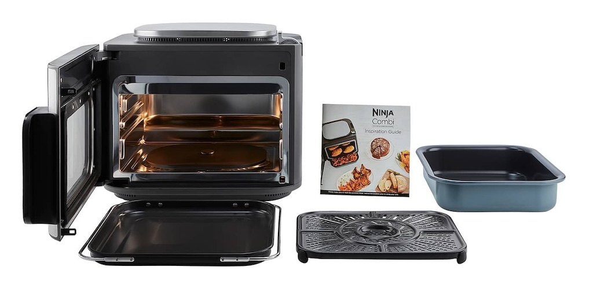

Yesterday, I went to a friend's place to chat about his home lab and network setup.
I found out he's got a Ninja Air Fryer.
They're pretty cool, and you can cook a lot with them.
My wife has been mentioning the Ninja brand every now and then, too.

After watching a few videos about the different Ninja products,
we were pretty impressed by the [Ninja 12-in-1 Combi Cooker](https://www.ninjakitchen.de/produkte/ninja-combi-12-in-1-multikocher-ofen-heissluftfritteuse-sfp700eu-zidSFP700EU).

After doing a lot of research on the
"What can you do with an Ninja Combi Cooker AirFryer?"
and watching a bunch of videos,
we decided to go for it and ordered one.
It arrived today.
It's still impressive how fast deliveries can be here in the Netherlands.

The Ninja is a bit bigger than our [Cosori Dual Blaze](https://cosori.com/products/dual-blaze-air-fryer),
which is pretty outdated and has been used a lot.
The Ninja has a lot more features,
but the main thing that made us buy one
is the ability to cook and bake with steam.
We've always wanted to try that, but never had the chance.

After unboxing it, we immediately tested it to prove its capabilities, and Sarah prepared the whole dinner with it.
We had potatoes with green beans and a "protein source"—a piece of pork.
It's wild how everyone's always talking about "protein sources" instead of pork, beef or chicken these days.

The potatoes and beans turned out nice and tender,
and the meat was juicy.
We also used our [Meater](https://store-de.meater.com/products/meater-plus) temperature probe to
check the "protein source" temperature.

After dinner, I was on the cleaning duty,
and I was surprised at how easy it was to clean the trays and the inside.
I used the kitchen machine to make some bread dough for further testing.
The dough rose really well with the steam function — looking great.
Baking the bread after another fold and second rest went really well.
The bread turned out fluffy and the crust was super crunchy.

We'll be using the steam function more often in the future.
